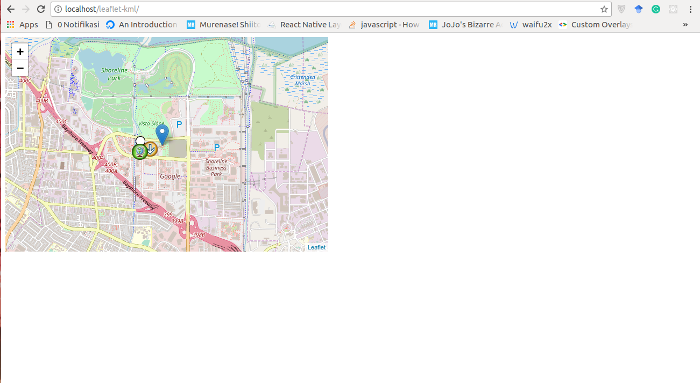

# Leaflet KML layer plugin

Demo: https://www.windy.com/uploader

This plugin was extracted from Pavel Shramov's Leaflet Plugins [repository](https://github.com/shramov/leaflet-plugins) in order to maintain this code more frequently and separate KML layer from other plugins.

I fix some issue in original repo.

Probablly will work on Leaflet 1+, tested on Leaflet 1.4.

## How to use

Make sure you have web server installed.

Clone this repo in your /var/www/html or another directory that become the root of your web server.

## Changelog

 * 1.1.0 - Updated README and fix some bugs
 * 1.0.1 - Updated README
 * 1.0.0 - Initial commit, original version with few fixes

## Licence

MIT
