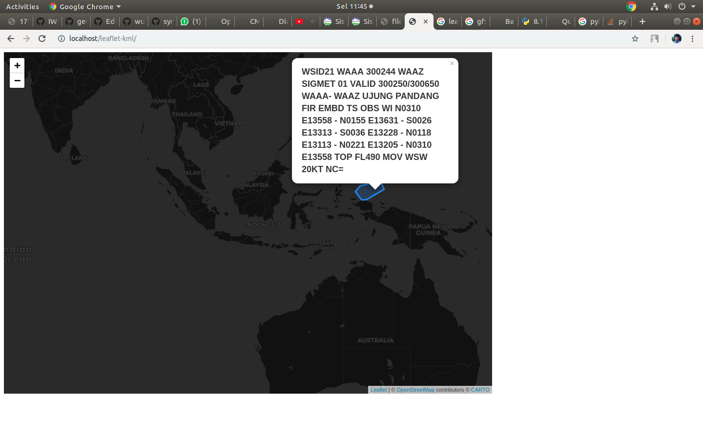

# SIGMET MAP

Sigmet polygons are extracted from the SIGMET code and build KML from it. Then the kml data is overlaid.

## How to use

Make sure you have web server installed.

Clone this repo in your /var/www/html or another directory that become the root of your web server.

## Changelog

 * 1.1.0 - Updated README and fix some bugs
 * 1.0.1 - Updated README
 * 1.0.0 - Initial commit, original version with few fixes

## Licence

MIT
